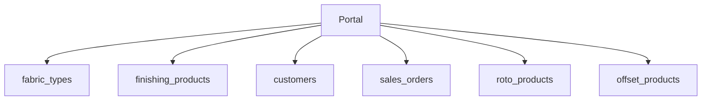

# 14 Dependency Graph

## Cross-Table Dependencies (FK from migrations)

- [supabase/migrations/001_initial_schema.sql](C:/Users/spsch/Downloads/ERP-main/ERP-main/supabase/migrations/001_initial_schema.sql:744): `alter table public.employees`
- [supabase/migrations/001_initial_schema.sql](C:/Users/spsch/Downloads/ERP-main/ERP-main/supabase/migrations/001_initial_schema.sql:2131): `ALTER TABLE public.accounts_journal`
- [supabase/migrations/001_initial_schema.sql](C:/Users/spsch/Downloads/ERP-main/ERP-main/supabase/migrations/001_initial_schema.sql:2162): `ALTER TABLE public.role_permissions`
- [supabase/migrations/001_initial_schema.sql](C:/Users/spsch/Downloads/ERP-main/ERP-main/supabase/migrations/001_initial_schema.sql:2170): `ALTER TABLE public.users`
- [supabase/migrations/001_initial_schema.sql](C:/Users/spsch/Downloads/ERP-main/ERP-main/supabase/migrations/001_initial_schema.sql:2177): `ALTER TABLE public.raw_material_purchases`
- [supabase/migrations/001_initial_schema.sql](C:/Users/spsch/Downloads/ERP-main/ERP-main/supabase/migrations/001_initial_schema.sql:2184): `ALTER TABLE public.raw_material_consumptions`
- [supabase/migrations/001_initial_schema.sql](C:/Users/spsch/Downloads/ERP-main/ERP-main/supabase/migrations/001_initial_schema.sql:2191): `ALTER TABLE public.employees`
- [supabase/migrations/001_initial_schema.sql](C:/Users/spsch/Downloads/ERP-main/ERP-main/supabase/migrations/001_initial_schema.sql:2198): `ALTER TABLE public.attendance`
- [supabase/migrations/001_initial_schema.sql](C:/Users/spsch/Downloads/ERP-main/ERP-main/supabase/migrations/001_initial_schema.sql:2206): `ALTER TABLE public.loom_production_entries`
- [supabase/migrations/001_initial_schema.sql](C:/Users/spsch/Downloads/ERP-main/ERP-main/supabase/migrations/001_initial_schema.sql:2216): `ALTER TABLE public.fabric_rolls`
- [supabase/migrations/001_initial_schema.sql](C:/Users/spsch/Downloads/ERP-main/ERP-main/supabase/migrations/001_initial_schema.sql:2226): `ALTER TABLE public.sales_orders`
- [supabase/migrations/001_initial_schema.sql](C:/Users/spsch/Downloads/ERP-main/ERP-main/supabase/migrations/001_initial_schema.sql:2234): `ALTER TABLE public.sales_order_items`
- [supabase/migrations/001_initial_schema.sql](C:/Users/spsch/Downloads/ERP-main/ERP-main/supabase/migrations/001_initial_schema.sql:2241): `ALTER TABLE public.stage_production_entries`
- [supabase/migrations/001_initial_schema.sql](C:/Users/spsch/Downloads/ERP-main/ERP-main/supabase/migrations/001_initial_schema.sql:2248): `ALTER TABLE public.accounts_journal`
- [supabase/migrations/001_initial_schema.sql](C:/Users/spsch/Downloads/ERP-main/ERP-main/supabase/migrations/001_initial_schema.sql:2405): `ALTER TABLE public.roto_products`
- [supabase/migrations/001_initial_schema.sql](C:/Users/spsch/Downloads/ERP-main/ERP-main/supabase/migrations/001_initial_schema.sql:2409): `ALTER TABLE public.offset_products`
- [supabase/migrations/001_initial_schema.sql](C:/Users/spsch/Downloads/ERP-main/ERP-main/supabase/migrations/001_initial_schema.sql:2782): `ALTER TABLE public.lamination_rolls RENAME COLUMN fabric_roll_id TO fabric_type_id;`
- [supabase/migrations/001_initial_schema.sql](C:/Users/spsch/Downloads/ERP-main/ERP-main/supabase/migrations/001_initial_schema.sql:2784): `ALTER TABLE public.lamination_rolls`
- [supabase/migrations/001_initial_schema.sql](C:/Users/spsch/Downloads/ERP-main/ERP-main/supabase/migrations/001_initial_schema.sql:2789): `ALTER TABLE public.offset_rolls RENAME COLUMN source_fabric_roll_id TO fabric_type_id;`
- [supabase/migrations/001_initial_schema.sql](C:/Users/spsch/Downloads/ERP-main/ERP-main/supabase/migrations/001_initial_schema.sql:2791): `ALTER TABLE public.offset_rolls`
- [supabase/migrations/001_initial_schema.sql](C:/Users/spsch/Downloads/ERP-main/ERP-main/supabase/migrations/001_initial_schema.sql:2796): `ALTER TABLE public.finishing_bundles RENAME COLUMN source_fabric_roll_id TO fabric_type_id;`
- [supabase/migrations/001_initial_schema.sql](C:/Users/spsch/Downloads/ERP-main/ERP-main/supabase/migrations/001_initial_schema.sql:2798): `ALTER TABLE public.finishing_bundles`
- [supabase/migrations/001_initial_schema.sql](C:/Users/spsch/Downloads/ERP-main/ERP-main/supabase/migrations/001_initial_schema.sql:2870): `ALTER TABLE public.roto_colors`
- [supabase/migrations/003_add_linked_customer_id.sql](C:/Users/spsch/Downloads/ERP-main/ERP-main/supabase/migrations/003_add_linked_customer_id.sql:2): `ALTER TABLE public.customers ADD COLUMN linked_customer_id uuid REFERENCES public.customers(id) ON D`
- [supabase/migrations/010_dynamic_lamination_and_finishing_products.sql](C:/Users/spsch/Downloads/ERP-main/ERP-main/supabase/migrations/010_dynamic_lamination_and_finishing_products.sql:68): `ALTER TABLE public.lamination_rolls`
- [supabase/migrations/010_dynamic_lamination_and_finishing_products.sql](C:/Users/spsch/Downloads/ERP-main/ERP-main/supabase/migrations/010_dynamic_lamination_and_finishing_products.sql:73): `ALTER TABLE public.finishing_bundles`
- [supabase/migrations/010_dynamic_lamination_and_finishing_products.sql](C:/Users/spsch/Downloads/ERP-main/ERP-main/supabase/migrations/010_dynamic_lamination_and_finishing_products.sql:88): `ALTER TABLE public.finishing_bundles ADD CONSTRAINT finishing_bundles_finish_type_check CHECK (finis`
- [supabase/migrations/010_dynamic_lamination_and_finishing_products.sql](C:/Users/spsch/Downloads/ERP-main/ERP-main/supabase/migrations/010_dynamic_lamination_and_finishing_products.sql:92): `ALTER TABLE public.sales_order_items`
- [supabase/migrations/044_product_purchase_enhancements.sql](C:/Users/spsch/Downloads/ERP-main/ERP-main/supabase/migrations/044_product_purchase_enhancements.sql:9): `ALTER TABLE public.finishing_bundles ADD COLUMN IF NOT EXISTS supplier_roll_id TEXT;`
- [supabase/migrations/044_product_purchase_enhancements.sql](C:/Users/spsch/Downloads/ERP-main/ERP-main/supabase/migrations/044_product_purchase_enhancements.sql:12): `ALTER TABLE public.product_purchase_items`
- [supabase/migrations/045_client_portal_setup.sql](C:/Users/spsch/Downloads/ERP-main/ERP-main/supabase/migrations/045_client_portal_setup.sql:9): `ALTER TABLE public.users`
- [supabase/migrations/045_client_portal_setup.sql](C:/Users/spsch/Downloads/ERP-main/ERP-main/supabase/migrations/045_client_portal_setup.sql:13): `ALTER TABLE public.fabric_types`
- [supabase/migrations/045_client_portal_setup.sql](C:/Users/spsch/Downloads/ERP-main/ERP-main/supabase/migrations/045_client_portal_setup.sql:18): `ALTER TABLE public.finishing_products`
- [supabase/migrations/048_add_production_fields_to_client_order_items.sql](C:/Users/spsch/Downloads/ERP-main/ERP-main/supabase/migrations/048_add_production_fields_to_client_order_items.sql:4): `ALTER TABLE public.client_order_items`
- [supabase/migrations/050_add_production_specs_to_finishing_products.sql](C:/Users/spsch/Downloads/ERP-main/ERP-main/supabase/migrations/050_add_production_specs_to_finishing_products.sql:4): `ALTER TABLE public.finishing_products`

## Admin

```mermaid
graph TD
  M_Admin["Admin"]
  M_Admin --> T_attendance["attendance"]
  M_Admin --> T_employees["employees"]
  M_Admin --> T_products["products"]
  M_Admin --> T_roto_products["roto_products"]
  M_Admin --> T_roto_product_colors["roto_product_colors"]
  M_Admin --> T_offset_products["offset_products"]
  M_Admin --> T_fabric_types["fabric_types"]
  M_Admin --> T_finishing_products["finishing_products"]
  M_Admin --> T_users["users"]
  M_Admin --> T_roles["roles"]
  M_Admin --> T_role_permissions["role_permissions"]
  M_Admin --> T_customers["customers"]
  M_Admin --> T_sales_orders["sales_orders"]
  M_Admin --> T_raw_materials["raw_materials"]
  M_Admin --> T_permissions["permissions"]
  M_Admin --> T_roto_colors["roto_colors"]
```

## Accounts

```mermaid
graph TD
  M_Accounts["Accounts"]
  M_Accounts --> T_customers["customers"]
  M_Accounts --> T_fabric_rolls["fabric_rolls"]
  M_Accounts --> T_raw_materials["raw_materials"]
  M_Accounts --> T_settings["settings"]
  M_Accounts --> T_accounts_journal["accounts_journal"]
  M_Accounts --> T_material_sales["material_sales"]
  M_Accounts --> T_fabric_types["fabric_types"]
  M_Accounts --> T_roto_products["roto_products"]
  M_Accounts --> T_offset_products["offset_products"]
  M_Accounts --> T_finishing_products["finishing_products"]
  M_Accounts --> T_roto_colors["roto_colors"]
  M_Accounts --> T_lamination_rolls["lamination_rolls"]
  M_Accounts --> T_offset_rolls["offset_rolls"]
  M_Accounts --> T_product_purchases["product_purchases"]
  M_Accounts --> T_roto_film_rolls["roto_film_rolls"]
  M_Accounts --> T_roto_metallic_rolls["roto_metallic_rolls"]
  M_Accounts --> T_finishing_bundles["finishing_bundles"]
  M_Accounts --> T_raw_material_purchases["raw_material_purchases"]
  M_Accounts --> T_sales_orders["sales_orders"]
  M_Accounts --> T_lamination_products["lamination_products"]
```

## Sales

```mermaid
graph TD
  M_Sales["Sales"]
  M_Sales --> T_users["users"]
  M_Sales --> T_client_orders["client_orders"]
  M_Sales --> T_client_order_items["client_order_items"]
  M_Sales --> T_sales_orders["sales_orders"]
  M_Sales --> T_sales_order_items["sales_order_items"]
  M_Sales --> T_fabric_rolls["fabric_rolls"]
  M_Sales --> T_lamination_rolls["lamination_rolls"]
  M_Sales --> T_offset_rolls["offset_rolls"]
  M_Sales --> T_finishing_bundles["finishing_bundles"]
  M_Sales --> T_customers["customers"]
  M_Sales --> T_accounts_journal["accounts_journal"]
  M_Sales --> T_roto_film_rolls["roto_film_rolls"]
  M_Sales --> T_roto_metallic_rolls["roto_metallic_rolls"]
  M_Sales --> T_raw_materials["raw_materials"]
  M_Sales --> T_material_sales["material_sales"]
  M_Sales --> T_fabric_types["fabric_types"]
  M_Sales --> T_roto_products["roto_products"]
  M_Sales --> T_offset_products["offset_products"]
  M_Sales --> T_lamination_products["lamination_products"]
  M_Sales --> T_finishing_products["finishing_products"]
```

## Inventory

```mermaid
graph TD
  M_Inventory["Inventory"]
  M_Inventory --> T_product_purchases["product_purchases"]
  M_Inventory --> T_fabric_types["fabric_types"]
  M_Inventory --> T_fabric_rolls["fabric_rolls"]
  M_Inventory --> T_roto_products["roto_products"]
  M_Inventory --> T_roto_colors["roto_colors"]
  M_Inventory --> T_roto_film_rolls["roto_film_rolls"]
  M_Inventory --> T_roto_metallic_rolls["roto_metallic_rolls"]
  M_Inventory --> T_lamination_rolls["lamination_rolls"]
  M_Inventory --> T_offset_products["offset_products"]
  M_Inventory --> T_offset_rolls["offset_rolls"]
  M_Inventory --> T_finishing_bundles["finishing_bundles"]
  M_Inventory --> T_product_purchase_items["product_purchase_items"]
  M_Inventory --> T_customers["customers"]
  M_Inventory --> T_accounts_journal["accounts_journal"]
  M_Inventory --> T_raw_material_purchases["raw_material_purchases"]
  M_Inventory --> T_raw_materials["raw_materials"]
  M_Inventory --> T_raw_material_consumptions["raw_material_consumptions"]
  M_Inventory --> T_sales_orders["sales_orders"]
  M_Inventory --> T_sales_order_items["sales_order_items"]
```

## Production

```mermaid
graph TD
  M_Production["Production"]
  M_Production --> T_loom_production_entries["loom_production_entries"]
  M_Production --> T_fabric_rolls["fabric_rolls"]
  M_Production --> T_roto_products["roto_products"]
  M_Production --> T_roto_colors["roto_colors"]
  M_Production --> T_roto_film_rolls["roto_film_rolls"]
  M_Production --> T_roto_metallic_rolls["roto_metallic_rolls"]
  M_Production --> T_lamination_rolls["lamination_rolls"]
  M_Production --> T_fabric_types["fabric_types"]
  M_Production --> T_offset_rolls["offset_rolls"]
  M_Production --> T_finishing_bundles["finishing_bundles"]
  M_Production --> T_offset_products["offset_products"]
  M_Production --> T_stage_production_entries["stage_production_entries"]
  M_Production --> T_raw_materials["raw_materials"]
  M_Production --> T_raw_material_consumptions["raw_material_consumptions"]
  M_Production --> T_looms["looms"]
  M_Production --> T_customers["customers"]
```

## Reports

```mermaid
graph TD
  M_Reports["Reports"]
  M_Reports --> T_customers["customers"]
  M_Reports --> T_accounts_journal["accounts_journal"]
  M_Reports --> T_settings["settings"]
  M_Reports --> T_raw_materials["raw_materials"]
  M_Reports --> T_raw_material_purchases["raw_material_purchases"]
  M_Reports --> T_raw_material_consumptions["raw_material_consumptions"]
  M_Reports --> T_material_sales["material_sales"]
  M_Reports --> T_fabric_types["fabric_types"]
  M_Reports --> T_sales_orders["sales_orders"]
  M_Reports --> T_fabric_rolls["fabric_rolls"]
  M_Reports --> T_lamination_rolls["lamination_rolls"]
  M_Reports --> T_offset_rolls["offset_rolls"]
  M_Reports --> T_finishing_bundles["finishing_bundles"]
  M_Reports --> T_roto_film_rolls["roto_film_rolls"]
  M_Reports --> T_roto_metallic_rolls["roto_metallic_rolls"]
  M_Reports --> T_loom_production_entries["loom_production_entries"]
  M_Reports --> T_attendance["attendance"]
  M_Reports --> T_employees["employees"]
  M_Reports --> T_roto_products["roto_products"]
  M_Reports --> T_offset_products["offset_products"]
  M_Reports --> T_lamination_products["lamination_products"]
  M_Reports --> T_finishing_products["finishing_products"]
  M_Reports --> T_sales_order_items["sales_order_items"]
```

## Dashboard

## Portal

## Core

