# 20 Sequence Diagrams

## saveProduction

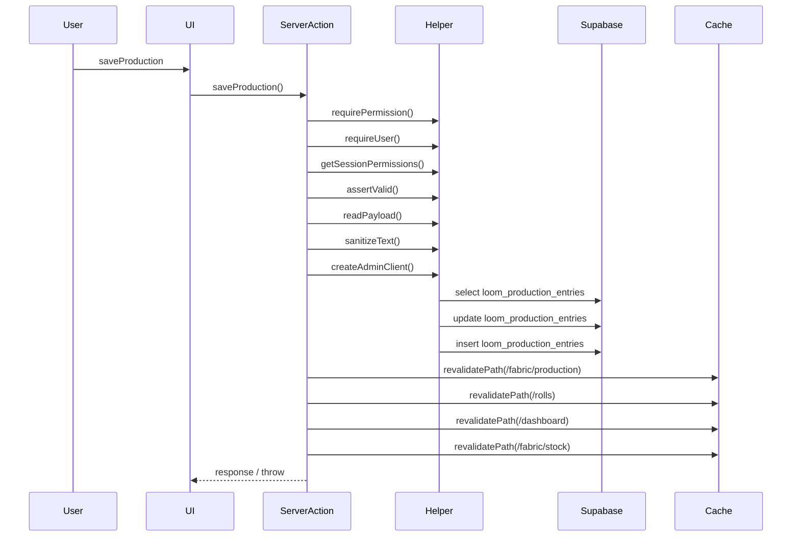

### Evidence Tree

```
- `saveProduction` [src/app/(app)/_actions/production.ts](C:/Users/spsch/Downloads/ERP-main/ERP-main/src/app/(app)/_actions/production.ts:14)
  - DB: `select` on `loom_production_entries`
  - DB: `update` on `loom_production_entries`
  - DB: `insert` on `loom_production_entries`
  - revalidatePath: `/fabric/production`, `/rolls`, `/dashboard`, `/fabric/stock`
  - throws: `error.message`
  - `requirePermission` [src/lib/auth.ts](C:/Users/spsch/Downloads/ERP-main/ERP-main/src/lib/auth.ts:108)
    - `requireUser` [src/lib/auth.ts](C:/Users/spsch/Downloads/ERP-main/ERP-main/src/lib/auth.ts:31)
    - `getSessionPermissions` [src/lib/auth.ts](C:/Users/spsch/Downloads/ERP-main/ERP-main/src/lib/auth.ts:102)
  - `getSessionPermissions` [src/lib/auth.ts](C:/Users/spsch/Downloads/ERP-main/ERP-main/src/lib/auth.ts:102)
  - `assertValid` [src/app/(app)/_actions/helpers.ts](C:/Users/spsch/Downloads/ERP-main/ERP-main/src/app/(app)/_actions/helpers.ts:125)
    - throws: `parsed.error.issues[0]?.message ?? "Invalid form data."`
  - `readPayload` [src/app/(app)/_actions/helpers.ts](C:/Users/spsch/Downloads/ERP-main/ERP-main/src/app/(app)/_actions/helpers.ts:49)
    - `sanitizeText` [src/app/(app)/_actions/helpers.ts](C:/Users/spsch/Downloads/ERP-main/ERP-main/src/app/(app)/_actions/helpers.ts:25)
  - `createAdminClient` [src/lib/supabase/admin.ts](C:/Users/spsch/Downloads/ERP-main/ERP-main/src/lib/supabase/admin.ts:5)
    - throws: `"Supabase admin credentials are missing. Set NEXT_PUBLIC_SUPABASE_URL and SUPABA`
```

## confirmSalesDelivery

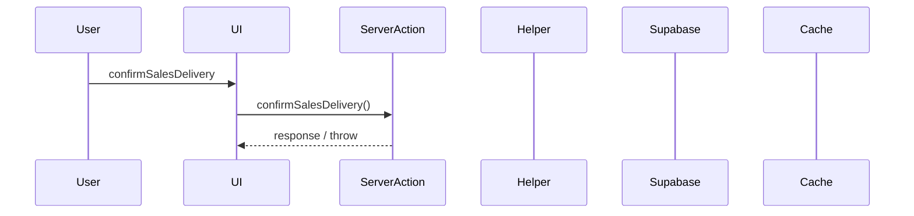

### Evidence Tree

```
- `confirmSalesDelivery` [src/app/(app)/_actions/sales.ts](C:/Users/spsch/Downloads/ERP-main/ERP-main/src/app/(app)/_actions/sales.ts:183)
```

## finalizeSalesOrderBilling

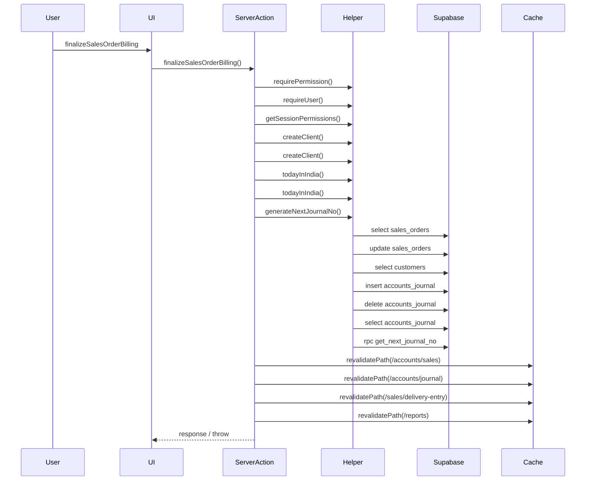

### Evidence Tree

```
- `finalizeSalesOrderBilling` [src/app/(app)/_actions/sales.ts](C:/Users/spsch/Downloads/ERP-main/ERP-main/src/app/(app)/_actions/sales.ts:554)
  - DB: `select` on `sales_orders`
  - DB: `update` on `sales_orders`
  - DB: `select` on `customers`
  - DB: `select` on `customers`
  - DB: `insert` on `accounts_journal`
  - DB: `update` on `sales_orders`
  - DB: `delete` on `accounts_journal`
  - revalidatePath: `/accounts/sales`, `/accounts/journal`, `/sales/delivery-entry`, `/reports`, `/accounts/sales`, `/accounts/journal`, `/sales/delivery-entry`, `/reports`
  - throws: `"Order ID and Bill Number are required."`; `"Bill Value must be a non-negative amount."`; `"Sales order not found."`; `"Order is not in draft billing state."`; `updateError.message`
  - `requirePermission` [src/lib/auth.ts](C:/Users/spsch/Downloads/ERP-main/ERP-main/src/lib/auth.ts:108)
    - `requireUser` [src/lib/auth.ts](C:/Users/spsch/Downloads/ERP-main/ERP-main/src/lib/auth.ts:31)
    - `getSessionPermissions` [src/lib/auth.ts](C:/Users/spsch/Downloads/ERP-main/ERP-main/src/lib/auth.ts:102)
  - `createClient` [src/lib/supabase/client.ts](C:/Users/spsch/Downloads/ERP-main/ERP-main/src/lib/supabase/client.ts:6)
  - `createClient` [src/lib/supabase/server.ts](C:/Users/spsch/Downloads/ERP-main/ERP-main/src/lib/supabase/server.ts:5)
  - `todayInIndia` [src/app/(app)/_actions/helpers.ts](C:/Users/spsch/Downloads/ERP-main/ERP-main/src/app/(app)/_actions/helpers.ts:40)
  - `todayInIndia` [src/lib/utils.ts](C:/Users/spsch/Downloads/ERP-main/ERP-main/src/lib/utils.ts:28)
  - `generateNextJournalNo` [src/app/(app)/_actions/helpers.ts](C:/Users/spsch/Downloads/ERP-main/ERP-main/src/app/(app)/_actions/helpers.ts:166)
    - DB: `select` on `accounts_journal`
    - DB: `rpc` on `get_next_journal_no`
```

## deleteSalesOrderCompletely

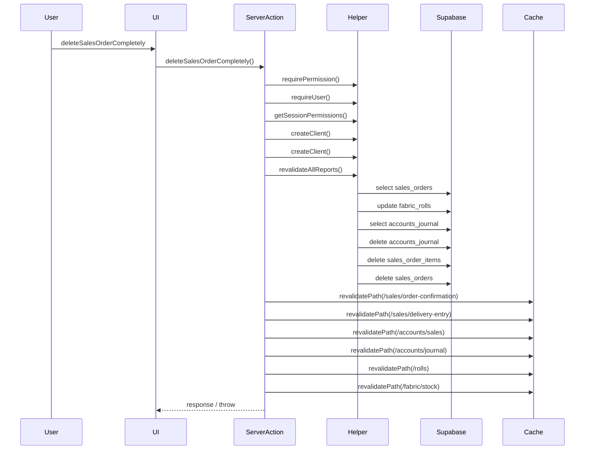

### Evidence Tree

```
- `deleteSalesOrderCompletely` [src/app/(app)/_actions/sales.ts](C:/Users/spsch/Downloads/ERP-main/ERP-main/src/app/(app)/_actions/sales.ts:694)
  - DB: `select` on `sales_orders`
  - DB: `update` on `fabric_rolls`
  - DB: `select` on `accounts_journal`
  - DB: `delete` on `accounts_journal`
  - DB: `delete` on `sales_order_items`
  - DB: `delete` on `sales_orders`
  - revalidatePath: `/sales/order-confirmation`, `/sales/delivery-entry`, `/accounts/sales`, `/accounts/journal`, `/rolls`, `/fabric/stock`
  - throws: `"Sales order not found or already deleted."`; `"Failed to reset roll statuses: " + rollUpdateErr.message`; `"Failed to delete related journal entries: " + journalDelErr.message`; `"Failed to delete sales order items: " + itemsDelErr.message`; `"Failed to delete sales order: " + orderDelErr.message`
  - `requirePermission` [src/lib/auth.ts](C:/Users/spsch/Downloads/ERP-main/ERP-main/src/lib/auth.ts:108)
    - `requireUser` [src/lib/auth.ts](C:/Users/spsch/Downloads/ERP-main/ERP-main/src/lib/auth.ts:31)
    - `getSessionPermissions` [src/lib/auth.ts](C:/Users/spsch/Downloads/ERP-main/ERP-main/src/lib/auth.ts:102)
  - `createClient` [src/lib/supabase/client.ts](C:/Users/spsch/Downloads/ERP-main/ERP-main/src/lib/supabase/client.ts:6)
  - `createClient` [src/lib/supabase/server.ts](C:/Users/spsch/Downloads/ERP-main/ERP-main/src/lib/supabase/server.ts:5)
  - `revalidateAllReports` [src/app/(app)/_actions/helpers.ts](C:/Users/spsch/Downloads/ERP-main/ERP-main/src/app/(app)/_actions/helpers.ts:29)
    - revalidatePath: `/reports`, `/reports/accounts`, `/reports/opening-balance`, `/reports/closing-stock`, `/reports/profit-loss`, `/reports/balance-sheet`, `/reports/sales-confirmation`, `/reports/stock`
```

## saveJournalEntry

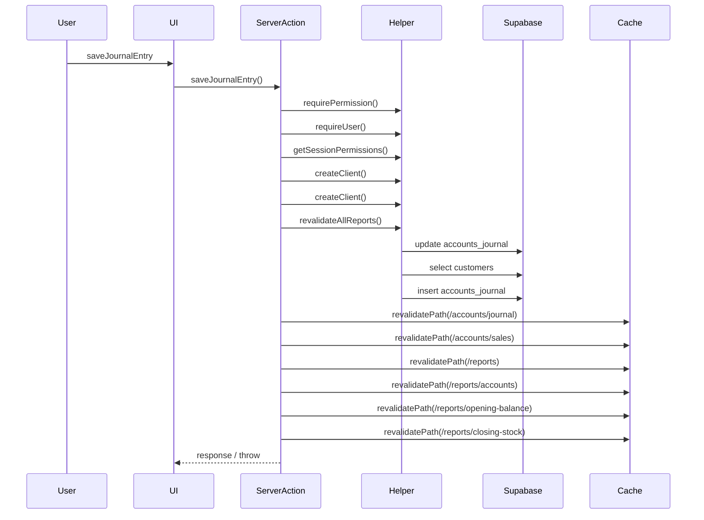

### Evidence Tree

```
- `saveJournalEntry` [src/app/(app)/_actions/journal.ts](C:/Users/spsch/Downloads/ERP-main/ERP-main/src/app/(app)/_actions/journal.ts:8)
  - DB: `update` on `accounts_journal`
  - DB: `select` on `customers`
  - DB: `insert` on `accounts_journal`
  - revalidatePath: `/accounts/journal`, `/accounts/sales`
  - throws: `"Missing required journal fields."`; `"At least 2 rows are required for a journal entry."`; `"Account name is required on all rows."`; `"A row cannot contain both Debit and Credit."`; `"Either Debit or Credit must be entered on all rows."`
  - `requirePermission` [src/lib/auth.ts](C:/Users/spsch/Downloads/ERP-main/ERP-main/src/lib/auth.ts:108)
    - `requireUser` [src/lib/auth.ts](C:/Users/spsch/Downloads/ERP-main/ERP-main/src/lib/auth.ts:31)
    - `getSessionPermissions` [src/lib/auth.ts](C:/Users/spsch/Downloads/ERP-main/ERP-main/src/lib/auth.ts:102)
  - `createClient` [src/lib/supabase/client.ts](C:/Users/spsch/Downloads/ERP-main/ERP-main/src/lib/supabase/client.ts:6)
  - `createClient` [src/lib/supabase/server.ts](C:/Users/spsch/Downloads/ERP-main/ERP-main/src/lib/supabase/server.ts:5)
  - `revalidateAllReports` [src/app/(app)/_actions/helpers.ts](C:/Users/spsch/Downloads/ERP-main/ERP-main/src/app/(app)/_actions/helpers.ts:29)
    - revalidatePath: `/reports`, `/reports/accounts`, `/reports/opening-balance`, `/reports/closing-stock`, `/reports/profit-loss`, `/reports/balance-sheet`, `/reports/sales-confirmation`, `/reports/stock`
```

## softDeleteJournalEntryGroup

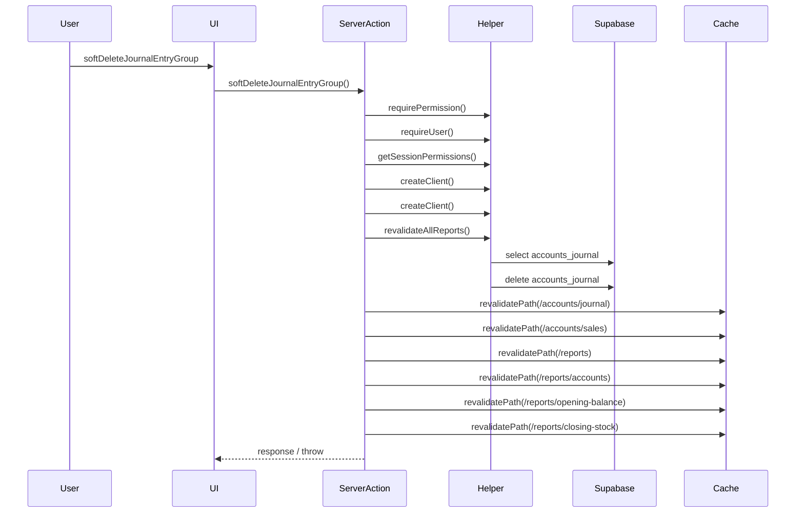

### Evidence Tree

```
- `softDeleteJournalEntryGroup` [src/app/(app)/_actions/journal.ts](C:/Users/spsch/Downloads/ERP-main/ERP-main/src/app/(app)/_actions/journal.ts:121)
  - DB: `select` on `accounts_journal`
  - DB: `delete` on `accounts_journal`
  - revalidatePath: `/accounts/journal`, `/accounts/sales`
  - throws: `"Missing journal number."`; `fetchErr.message`; `"Cannot delete auto-generated journal entries."`; `error.message`
  - `requirePermission` [src/lib/auth.ts](C:/Users/spsch/Downloads/ERP-main/ERP-main/src/lib/auth.ts:108)
    - `requireUser` [src/lib/auth.ts](C:/Users/spsch/Downloads/ERP-main/ERP-main/src/lib/auth.ts:31)
    - `getSessionPermissions` [src/lib/auth.ts](C:/Users/spsch/Downloads/ERP-main/ERP-main/src/lib/auth.ts:102)
  - `createClient` [src/lib/supabase/client.ts](C:/Users/spsch/Downloads/ERP-main/ERP-main/src/lib/supabase/client.ts:6)
  - `createClient` [src/lib/supabase/server.ts](C:/Users/spsch/Downloads/ERP-main/ERP-main/src/lib/supabase/server.ts:5)
  - `revalidateAllReports` [src/app/(app)/_actions/helpers.ts](C:/Users/spsch/Downloads/ERP-main/ERP-main/src/app/(app)/_actions/helpers.ts:29)
    - revalidatePath: `/reports`, `/reports/accounts`, `/reports/opening-balance`, `/reports/closing-stock`, `/reports/profit-loss`, `/reports/balance-sheet`, `/reports/sales-confirmation`, `/reports/stock`
```

## saveRawMaterialPurchase

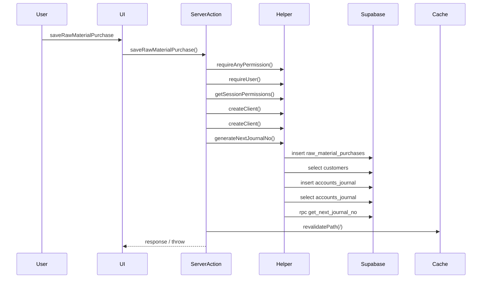

### Evidence Tree

```
- `saveRawMaterialPurchase` [src/app/(app)/_actions/purchases.ts](C:/Users/spsch/Downloads/ERP-main/ERP-main/src/app/(app)/_actions/purchases.ts:8)
  - DB: `insert` on `raw_material_purchases`
  - DB: `select` on `customers`
  - DB: `select` on `customers`
  - DB: `insert` on `accounts_journal`
  - revalidatePath: `/`
  - throws: `"Purchase date, client, and bill number are required."`; `"Total bill value must be a positive amount."`; `"At least one raw material item must be added."`; `"Every purchase item must have a material, positive quantity, and positive rate.`; `error.message`
  - `requireAnyPermission` [src/lib/auth.ts](C:/Users/spsch/Downloads/ERP-main/ERP-main/src/lib/auth.ts:116)
    - `requireUser` [src/lib/auth.ts](C:/Users/spsch/Downloads/ERP-main/ERP-main/src/lib/auth.ts:31)
    - `getSessionPermissions` [src/lib/auth.ts](C:/Users/spsch/Downloads/ERP-main/ERP-main/src/lib/auth.ts:102)
  - `createClient` [src/lib/supabase/client.ts](C:/Users/spsch/Downloads/ERP-main/ERP-main/src/lib/supabase/client.ts:6)
  - `createClient` [src/lib/supabase/server.ts](C:/Users/spsch/Downloads/ERP-main/ERP-main/src/lib/supabase/server.ts:5)
  - `generateNextJournalNo` [src/app/(app)/_actions/helpers.ts](C:/Users/spsch/Downloads/ERP-main/ERP-main/src/app/(app)/_actions/helpers.ts:166)
    - DB: `select` on `accounts_journal`
    - DB: `rpc` on `get_next_journal_no`
```

## saveProductPurchase

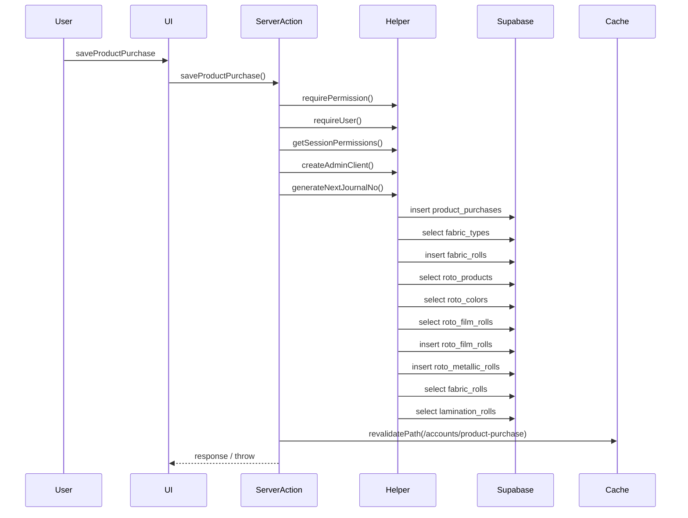

### Evidence Tree

```
- `saveProductPurchase` [src/app/(app)/_actions/product-purchase.ts](C:/Users/spsch/Downloads/ERP-main/ERP-main/src/app/(app)/_actions/product-purchase.ts:8)
  - DB: `insert` on `product_purchases`
  - DB: `select` on `fabric_types`
  - DB: `insert` on `fabric_rolls`
  - DB: `select` on `roto_products`
  - DB: `select` on `roto_colors`
  - DB: `select` on `roto_film_rolls`
  - DB: `insert` on `roto_film_rolls`
  - DB: `insert` on `roto_film_rolls`
  - DB: `insert` on `roto_metallic_rolls`
  - DB: `select` on `fabric_rolls`
  - DB: `select` on `roto_products`
  - DB: `select` on `lamination_rolls`
  - DB: `insert` on `lamination_rolls`
  - DB: `update` on `fabric_rolls`
  - DB: `select` on `lamination_rolls`
  - DB: `select` on `offset_products`
  - DB: `select` on `offset_rolls`
  - DB: `insert` on `offset_rolls`
  - DB: `update` on `lamination_rolls`
  - DB: `select` on `fabric_rolls`
  - DB: `select` on `lamination_rolls`
  - DB: `select` on `offset_rolls`
  - DB: `select` on `finishing_bundles`
  - DB: `insert` on `finishing_bundles`
  - DB: `update` on `fabric_rolls`
  - DB: `update` on `lamination_rolls`
  - DB: `update` on `offset_rolls`
  - DB: `insert` on `product_purchase_items`
  - DB: `delete` on `product_purchases`
  - DB: `select` on `customers`
  - DB: `select` on `customers`
  - DB: `insert` on `accounts_journal`
  - DB: `rpc` on `next_year_number`
  - revalidatePath: `/accounts/product-purchase`
  - throws: `"Purchase date, supplier, and bill number are required."`; `"Total bill value must be a positive amount."`; `"At least one purchase item must be added."`; `headerError?.message || "Failed to create product purchase record."`; ``Fabric roll stock insert failed: ${stockErr.message}``
  - `requirePermission` [src/lib/auth.ts](C:/Users/spsch/Downloads/ERP-main/ERP-main/src/lib/auth.ts:108)
    - `requireUser` [src/lib/auth.ts](C:/Users/spsch/Downloads/ERP-main/ERP-main/src/lib/auth.ts:31)
    - `getSessionPermissions` [src/lib/auth.ts](C:/Users/spsch/Downloads/ERP-main/ERP-main/src/lib/auth.ts:102)
  - `createAdminClient` [src/lib/supabase/admin.ts](C:/Users/spsch/Downloads/ERP-main/ERP-main/src/lib/supabase/admin.ts:5)
    - throws: `"Supabase admin credentials are missing. Set NEXT_PUBLIC_SUPABASE_URL and SUPABA`
  - `generateNextJournalNo` [src/app/(app)/_actions/helpers.ts](C:/Users/spsch/Downloads/ERP-main/ERP-main/src/app/(app)/_actions/helpers.ts:166)
    - DB: `select` on `accounts_journal`
    - DB: `rpc` on `get_next_journal_no`
```

## saveClosingStock

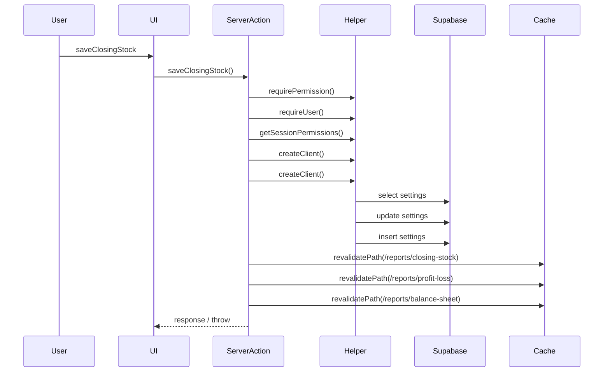

### Evidence Tree

```
- `saveClosingStock` [src/app/(app)/_actions/accounts.ts](C:/Users/spsch/Downloads/ERP-main/ERP-main/src/app/(app)/_actions/accounts.ts:137)
  - DB: `select` on `settings`
  - DB: `update` on `settings`
  - DB: `insert` on `settings`
  - revalidatePath: `/reports/closing-stock`, `/reports/profit-loss`, `/reports/balance-sheet`
  - throws: `error.message`; `error.message`
  - `requirePermission` [src/lib/auth.ts](C:/Users/spsch/Downloads/ERP-main/ERP-main/src/lib/auth.ts:108)
    - `requireUser` [src/lib/auth.ts](C:/Users/spsch/Downloads/ERP-main/ERP-main/src/lib/auth.ts:31)
    - `getSessionPermissions` [src/lib/auth.ts](C:/Users/spsch/Downloads/ERP-main/ERP-main/src/lib/auth.ts:102)
  - `createClient` [src/lib/supabase/client.ts](C:/Users/spsch/Downloads/ERP-main/ERP-main/src/lib/supabase/client.ts:6)
  - `createClient` [src/lib/supabase/server.ts](C:/Users/spsch/Downloads/ERP-main/ERP-main/src/lib/supabase/server.ts:5)
```

## approveClientOrder

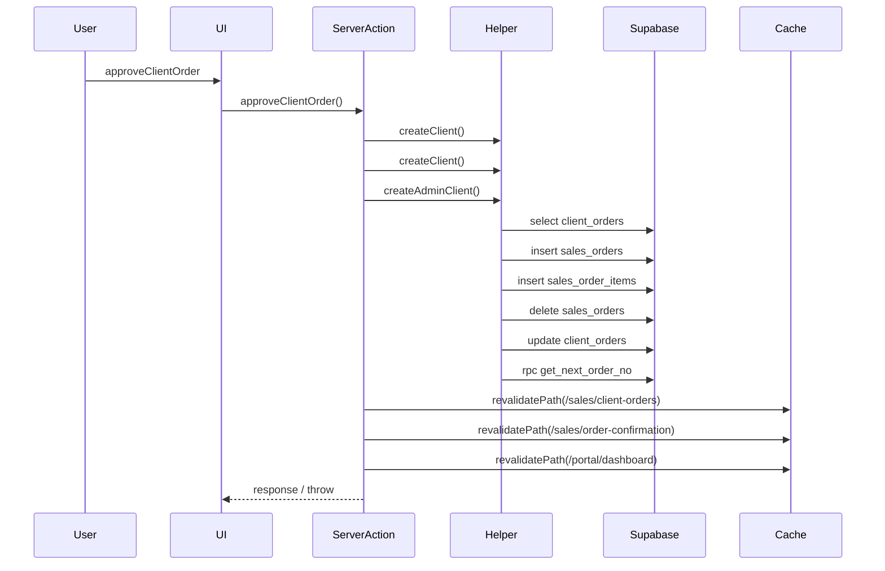

### Evidence Tree

```
- `approveClientOrder` [src/app/(app)/_actions/client-orders.ts](C:/Users/spsch/Downloads/ERP-main/ERP-main/src/app/(app)/_actions/client-orders.ts:100)
  - DB: `select` on `client_orders`
  - DB: `insert` on `sales_orders`
  - DB: `insert` on `sales_order_items`
  - DB: `delete` on `sales_orders`
  - DB: `update` on `client_orders`
  - DB: `rpc` on `get_next_order_no`
  - revalidatePath: `/sales/client-orders`, `/sales/order-confirmation`, `/portal/dashboard`
  - throws: `"Unauthorized"`; `"Client order not found."`; `"Order is already processed."`; ``Failed to create ERP order: ${salesOrderErr.message}``; ``Failed to create ERP order items: ${itemsErr.message}``
  - `createClient` [src/lib/supabase/client.ts](C:/Users/spsch/Downloads/ERP-main/ERP-main/src/lib/supabase/client.ts:6)
  - `createClient` [src/lib/supabase/server.ts](C:/Users/spsch/Downloads/ERP-main/ERP-main/src/lib/supabase/server.ts:5)
  - `createAdminClient` [src/lib/supabase/admin.ts](C:/Users/spsch/Downloads/ERP-main/ERP-main/src/lib/supabase/admin.ts:5)
    - throws: `"Supabase admin credentials are missing. Set NEXT_PUBLIC_SUPABASE_URL and SUPABA`
```

## consumeFabricRoll

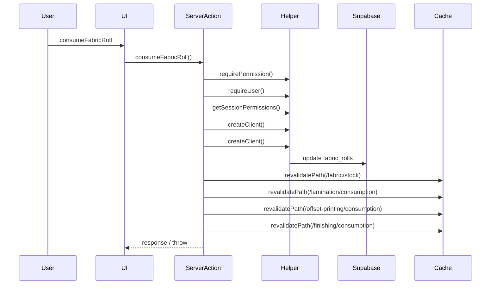

### Evidence Tree

```
- `consumeFabricRoll` [src/app/(app)/_actions/raw-materials.ts](C:/Users/spsch/Downloads/ERP-main/ERP-main/src/app/(app)/_actions/raw-materials.ts:130)
  - DB: `update` on `fabric_rolls`
  - revalidatePath: `/fabric/stock`, `/lamination/consumption`, `/offset-printing/consumption`, `/finishing/consumption`
  - throws: `error.message`
  - `requirePermission` [src/lib/auth.ts](C:/Users/spsch/Downloads/ERP-main/ERP-main/src/lib/auth.ts:108)
    - `requireUser` [src/lib/auth.ts](C:/Users/spsch/Downloads/ERP-main/ERP-main/src/lib/auth.ts:31)
    - `getSessionPermissions` [src/lib/auth.ts](C:/Users/spsch/Downloads/ERP-main/ERP-main/src/lib/auth.ts:102)
  - `createClient` [src/lib/supabase/client.ts](C:/Users/spsch/Downloads/ERP-main/ERP-main/src/lib/supabase/client.ts:6)
  - `createClient` [src/lib/supabase/server.ts](C:/Users/spsch/Downloads/ERP-main/ERP-main/src/lib/supabase/server.ts:5)
```

## clearSystemTransactions

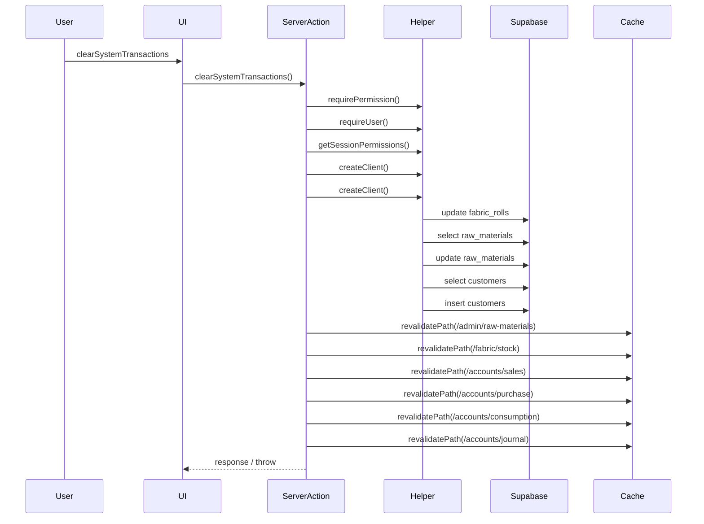

### Evidence Tree

```
- `clearSystemTransactions` [src/app/(app)/_actions/accounts.ts](C:/Users/spsch/Downloads/ERP-main/ERP-main/src/app/(app)/_actions/accounts.ts:38)
  - DB: `update` on `fabric_rolls`
  - DB: `select` on `raw_materials`
  - DB: `update` on `raw_materials`
  - DB: `select` on `customers`
  - DB: `select` on `customers`
  - DB: `insert` on `customers`
  - revalidatePath: `/admin/raw-materials`, `/fabric/stock`, `/accounts/sales`, `/accounts/purchase`, `/accounts/consumption`, `/accounts/journal`, `/reports/stock`, `/reports/closing-stock`, `/reports/accounts`, `/dashboard`
  - throws: ``Failed to clear table ${table}: ${error.message}``; ``Failed to reset fabric rolls: ${rollResetErr.message}``; ``Failed to fetch raw materials: ${fetchRmErr.message}``; ``Failed to reset raw material stock for ${rm.id}: ${rmResetErr.message}``
  - `requirePermission` [src/lib/auth.ts](C:/Users/spsch/Downloads/ERP-main/ERP-main/src/lib/auth.ts:108)
    - `requireUser` [src/lib/auth.ts](C:/Users/spsch/Downloads/ERP-main/ERP-main/src/lib/auth.ts:31)
    - `getSessionPermissions` [src/lib/auth.ts](C:/Users/spsch/Downloads/ERP-main/ERP-main/src/lib/auth.ts:102)
  - `createClient` [src/lib/supabase/client.ts](C:/Users/spsch/Downloads/ERP-main/ERP-main/src/lib/supabase/client.ts:6)
  - `createClient` [src/lib/supabase/server.ts](C:/Users/spsch/Downloads/ERP-main/ERP-main/src/lib/supabase/server.ts:5)
```

